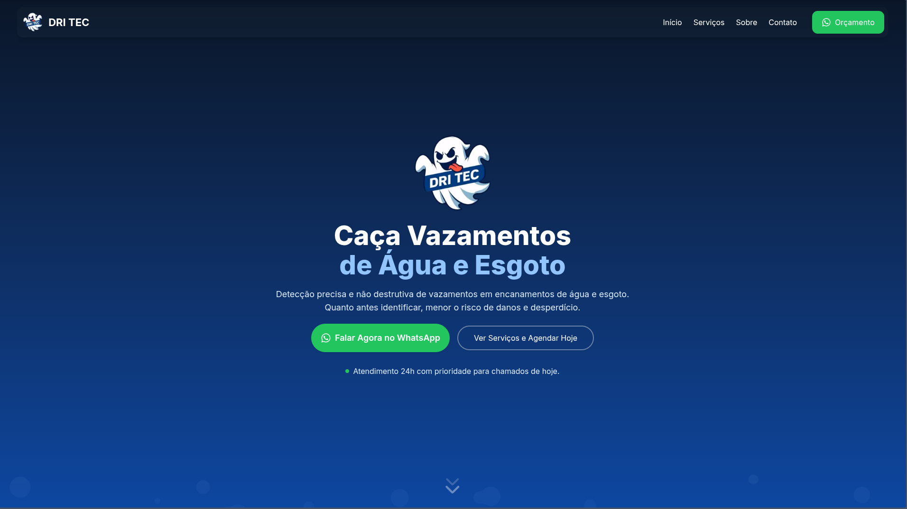

# Dritec

Landing page institucional da Dritec para apresentação de serviços de caça vazamentos e contato comercial.

## Tecnologias usadas

* Next.js
* React
* TypeScript
* Tailwind
* ESLint

## Preview



## Acesse o projeto

https://dritec.vercel.app

## Estrutura

* /app → rotas e estrutura principal do App Router
* /components → componentes e seções da página
* /lib → funções utilitárias
* /public → imagens e arquivos estáticos

## Como rodar localmente

```bash
git clone https://github.com/seuusuario/projeto.git
cd dritec
npm install
npm run dev
```

## Autor

renanrod4 — [portfolio](https://renanrod.vercel.app/)/[linkedIn](https://www.linkedin.com/in/renanrod4/)

## Licença

Este projeto é de uso privado para o cliente Dritec.
